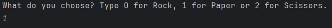
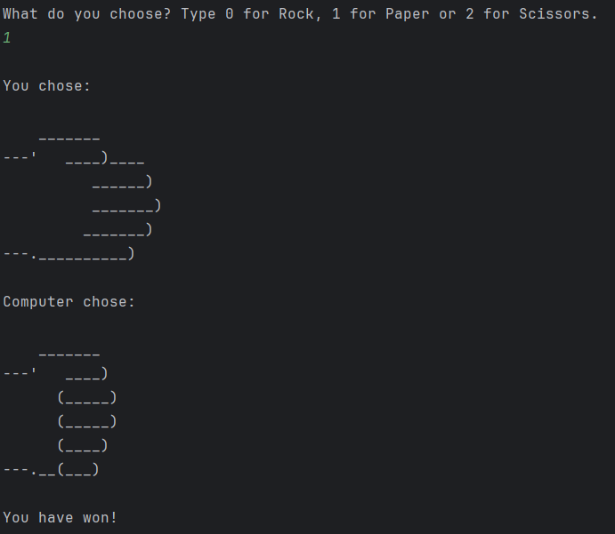

# Rock–Paper–Scissors (Python)

Prosta gra konsolowa napisana w Pythonie, pozwalająca użytkownikowi zagrać w klasyczne **Papier–Kamień–Nożyce** przeciwko komputerowi. Program wykorzystuje losowanie, instrukcje warunkowe oraz ASCII‑art do wizualnej prezentacji ruchów.

Projekt jest idealnym przykładem podstawowej logiki gry, obsługi wejścia użytkownika oraz pracy z listami i warunkami.

---

## Cel projektu

Celem projektu jest stworzenie prostej gry konsolowej, która:

- pozwala użytkownikowi wybrać ruch (0 – Kamień, 1 – Papier, 2 – Nożyce),
- losuje ruch komputera,
- wyświetla oba ruchy w formie ASCII‑art,
- określa zwycięzcę na podstawie zasad gry,
- obsługuje błędne dane wejściowe.

Projekt pokazuje umiejętność pracy z podstawowymi elementami Pythona: listami, instrukcjami warunkowymi, losowaniem oraz interakcją z użytkownikiem.

---

## Technologie

- **Python 3**
- **random** – losowanie ruchu komputera
- **ASCII‑art** – wizualna prezentacja ruchów
- **Instrukcje warunkowe** – logika gry

---

## Struktura projektu

```
rock_paper_scissors/
│── main.py        # główny plik gry
│── README.md      # dokumentacja projektu
│── .gitignore     # ignorowane pliki i foldery
│── images/        # zrzuty ekranu używane w dokumentacji
```

---

## Zrzuty ekranu


### Wybór gracza


*Użytkownik wybiera swój ruch, a gra wyświetla odpowiedni ASCII‑art.*


### Wynik rundy


*Gra prezentuje ruch gracza i komputera, a następnie wyświetla informację o zwycięzcy rundy.*


---

## Funkcjonalności aplikacji

- Wybór ruchu przez użytkownika (0/1/2).
- Losowanie ruchu komputera.
- Wyświetlanie ASCII‑art dla obu ruchów.
- Logika określająca zwycięzcę.
- Obsługa niepoprawnych danych wejściowych.
- Prosta, czytelna struktura kodu.

---

## Uruchomienie

Uruchom:

```bash
python main.py
```

---

## Możliwe ulepszenia

- dodanie pętli gry (gra do 3 zwycięstw),
- dodanie statystyk (wygrane/przegrane/remisy),
- dodanie trybu „best of 5”,
- dodanie kolorów w konsoli (biblioteka `colorama`),
- dodanie GUI (tkinter / ttkbootstrap),
- dodanie wersji multiplayer (2 graczy na jednym komputerze).

